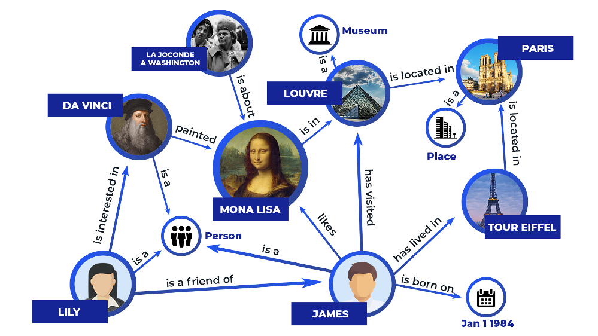
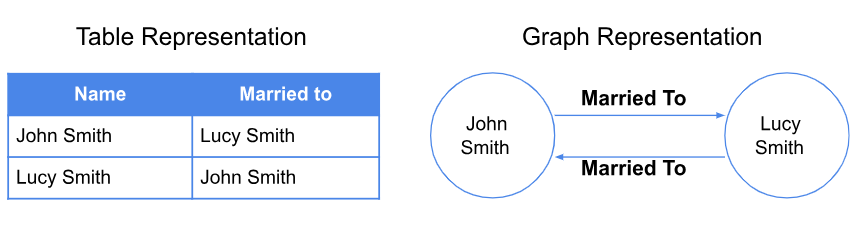

# Knowledge Graph RAG

*[Improving Knowledge Graph Completion with Generative LM and neighbors](https://deeppavlov.ai/research/tpost/bn15u1y4v1-improving-knowledge-graph-completion-wit)*

In the evolving landscape of AI and information retrieval, knowledge graphs have emerged as a powerful way to represent complex, interconnected information. A knowledge graph is a knowledge base that uses a graph-structured data model or topology to represent and operate on data. Knowledge graphs are often used to store interlinked descriptions of entities – objects, events, situations or abstract concepts – while also encoding the free-form semantics or relationships underlying these entities. [Source: Wikipedia](https://en.wikipedia.org/wiki/Knowledge_graph)

What makes knowledge graphs particularly powerful is their ability to mirror human cognition in data. They more explicitly map the relationships between objects, concepts, or ideas together through both their semantic and relational connections. This approach closely parallels how our brains naturally understand and internalize information – not as isolated facts, but as a web of interconnected concepts and relationships.

Looking at a concept like "coffee," we don't just know it's a beverage; we automatically connect it to related concepts like beans, brewing methods, caffeine, morning routines, and social interactions. Knowledge graphs capture these natural associations in a structured way.

Traditional RAG systems, while effective at semantic similarity-based retrieval, often struggle to capture broader conceptual relationships across text chunks. Knowledge Graph RAG addresses this limitation by introducing a structured, hierarchical approach to information organization and retrieval. By representing data in a graph format, these systems can traverse relationships between concepts, enabling more sophisticated query understanding and response generation. This approach allows for targeted querying along specific relationship paths, handles complex multi-hop questions, and provides clearer reasoning through explicit connection paths. The result is a more nuanced and interpretable system that combines the structured reasoning of knowledge graphs with the natural language capabilities of large language models.

While [knowledge graphs are not a new concept](https://blog.google/products/search/introducing-knowledge-graph-things-not/), their creation has traditionally been a resource-intensive process. Early knowledge graphs were built either through manual curation by domain experts or by converting existing structured data from relational databases. This limited both their scale and adaptability to new domains.

*[What is a Knowledge Graph (KG)?](https://zilliz.com/learn/what-is-knowledge-graph)*

The introduction of LLMs has transformed this landscape. LLMs' capabilities in NLP, reasoning, and relationship extraction now enable automated construction of knowledge graphs from unstructured text. These models can identify entities, infer relationships, and structure information in ways that previously required extensive manual labor. As a plus, this allows knowledge graphs to be dynamically updated and expanded as new information becomes available, making them more practical and scalable for real-world applications.

To see this in action ourselves, and compare it to traditional vector similarity techniques, we'll take a look at Microsoft's Open Source [GraphRAG](https://microsoft.github.io/graphrag/) and how it works behind the scenes.
